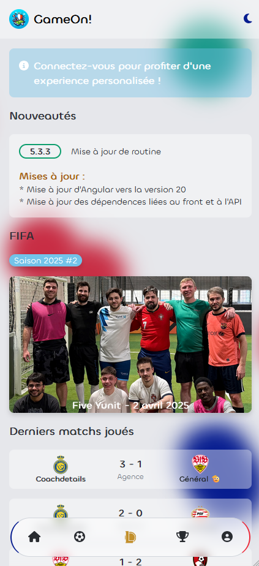

    

<h1 align="center">GameOn! Front-end</h1>

# Description

This project is a front-end for the GameOn! Front-End, done using Angular 21 / TailwindCSS v4, and will be running live on [this site](https://gameon.valentinvirot.fr/).

Currently, this front-end uses multiple concepts, such as :

- Dependency Injection
- Multiple layout
- Advanced routing
- Login with Keycloak
- State Management (NgRx, ...)
- Administration portal (with different layout)
- Lazy loading
- ...

Data is directly coming from the [GameOn! API](https://gameon-api.valentinvirot.fr/swagger).

## How to run it?

Just type `npm ci` to get all dependencies, and then use `ng serve` to run it locally.
You can also use my Dockerfile to use it (it exposes the 80 port).

## Can I use it for my own?

If this repo is public, you can clone/fork my project and use it for your own website. Just credit me somewhere in your site, as a thanks for my work :)

You can contact me using my [Portfolio](https://www.valentinvirot.fr), if you have some question about it. Have fun!
